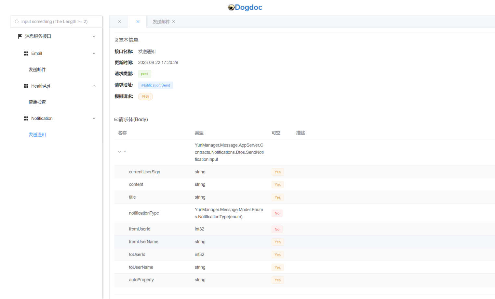

# dogdoc

A beaultiful api document who depends on swagger.json
在分布式的系统中，随着系统功能的完善，后台服务模块会变得越来越多。
一般情况下，我们会为每个模块添加相应的 swagger 来用于开发或测试。这导致我们往往需要保存很多个 swagger 的地址，使用起来十分不便。
更重要的是，我们想要使用一些不熟悉的服务模块中的接口时，查找接口的位置就显得十分困难了，
尤其是有些开发喜欢把每个服务内的 swagger 按接口的领域继续细化拆分，这对多服务系统显得十分不友好。

Dogdoc 是一个为了解决这些问题而诞生的一个轻量的 api 文档系统。

部署十分简单，数据来源目前仅支持 swagger.json 3.0 版。



## 优势：

- 1、整合所有 swagger 接口，无需保存每个 swagger 地址
- 2、每 10 分钟会自动更新接口数据（默认 10 分钟，可以修改）
- 3、支持全域检索功能，方便我们快速的找到我们需要的接口
- 4、接口数据可视化，可以清晰地查看所有接口信息，属性含义等等
- 5、方便复制接口名称，地址等数据信息
- 6、统一的接口管理，易发现一些不规范的接口，有利于接口的完善
- 7、支持模拟请求，可以用于测试接口（该功能仅作为辅助功能）

## 部署：

- 1、安装 node.js
- 2、下载 dogdoc 项目到服务器
- 3、在根目录找到 config.js 文件
  打开文件内容如下：

```
module.exports = {
  updateCycle: 10,
  sources: [
    {
      name: "Admin管理员接口",
      url: "http://**.**.**.**:5002/swagger",
    }
  ],
};
```

updateCycle 表示更新的频率，默认是 10min

sources 是所有 swagger 的地址，Name 是服务名称，url 是地址，如果有一个服务被拆分成多个的 swagger 的，仅需提供该服务的任意一个即可，系统会自动完成获取填充。

- 4、在项目的根目录，打开命令窗口，执行 node app.js 即可。
- 5、访问 http://localhost:3000/ 进入 dogdoc。

开源不易，如果 dogdoc 对您有所帮助，就给个小星星吧。

WeChat 我要打赏


